# Учебный проект сайта книжного магазина
Проект выполнен на Flask, с использованием базы данных Postgres для хранения данных сайта, и redis 
для хранения кодов для подтверждения регистрации. \
А так же использовался фреймворк bootstrap для разметки и оформления страницы.

## Запуск проекта

### 1. Установка необходимого ПО
Для работы нужен установленный **Docker**. \
Если он не установлен вы можете [скачать тут](https://www.docker.com/get-started/).

### 2. Клонирование репозитория

### 3. Окружение
В проекте представлен пример файла окружения .env.example. Поменяйте название на .env, или создайте свой файл с переменными.

### 4. Запуск
```bash
docker-compose up --build
```
- Приложение будет доступно на: [http://localhost:8000/](http://localhost:8000/)
- Postgres и redis поднимутся внутри Docker (db), (redis)
- База данных будет уже заполнена основными данными

#### Основные команды
Остановка контейнера:
```bash
docker-compose down
```
Перезапуск с очисткой
```bash
docker-compose down -v
docker-compose up --build
```

## Описание проекта
Приложение представляет собой сайт магазина книг\
### Главная страница
- Просмотр книг
- Добавление в корзину
- Поиск по книгам
- Боковое меню для поиска по определенным жанрам \
 

#### Разделы и жанры
На главной странице представлены книги по разделам, нажав на название раздела (или в боковом меню "Все книги"), будет 
переход к книгам определенного раздела, в котором книги представлены по жанрам. 

Нажав на название жанра или выбрав его в боковом меню, можно прейти к списку книг в определенном жанре.
#### Страница книги
На странице книги представлена подробная информация о ней, рейтинг, аннотация, рецензии

##### Рецензия
Пользователь может оставить рецензию на книгу
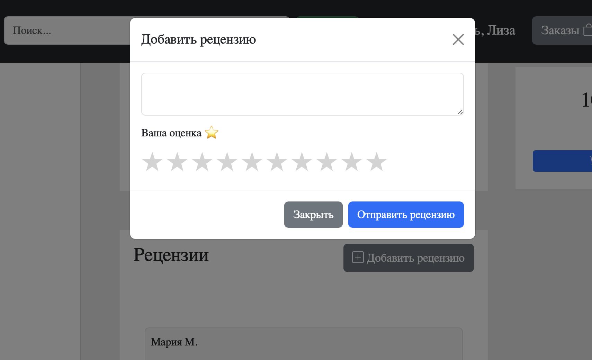
Или может легко удалить свой отзыв на книгу
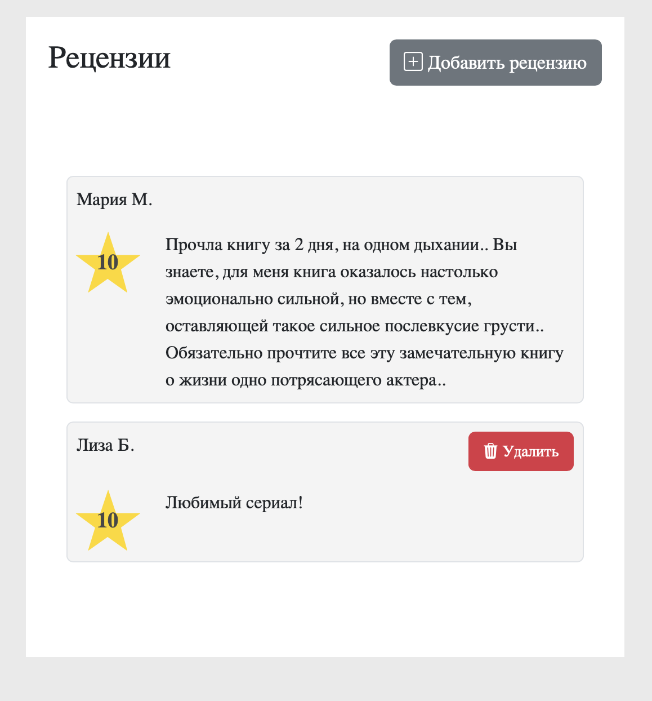


### Вход и регистрация

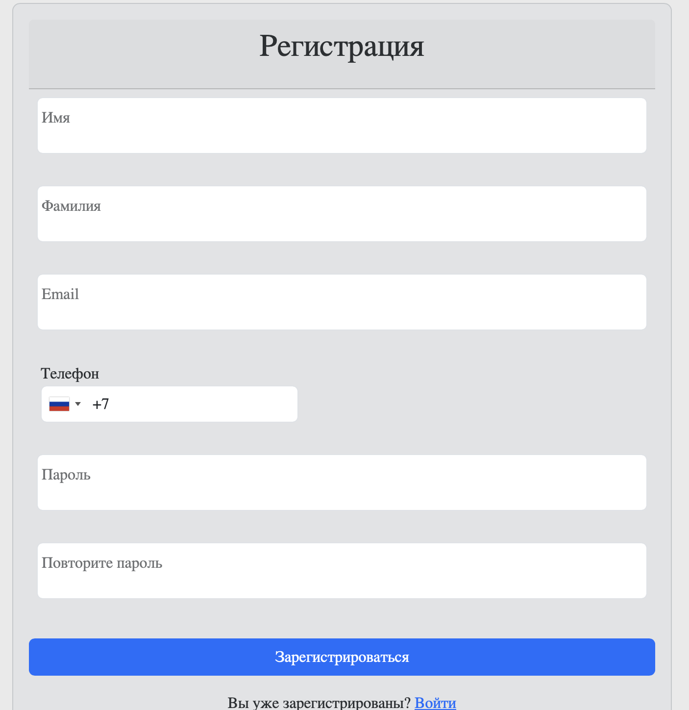
Для подтверждения информации, пользователю необходимо будет ввести проверочный код. Это имитация отправленной смс. \
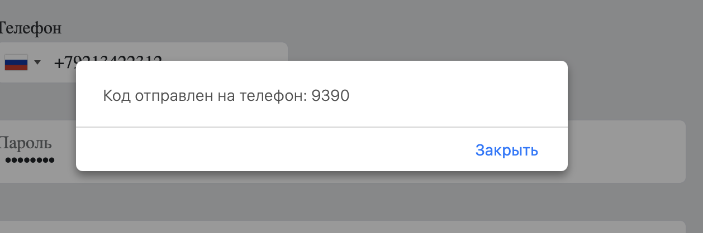
После удачного ввода кода, перенаправление на страницу входа
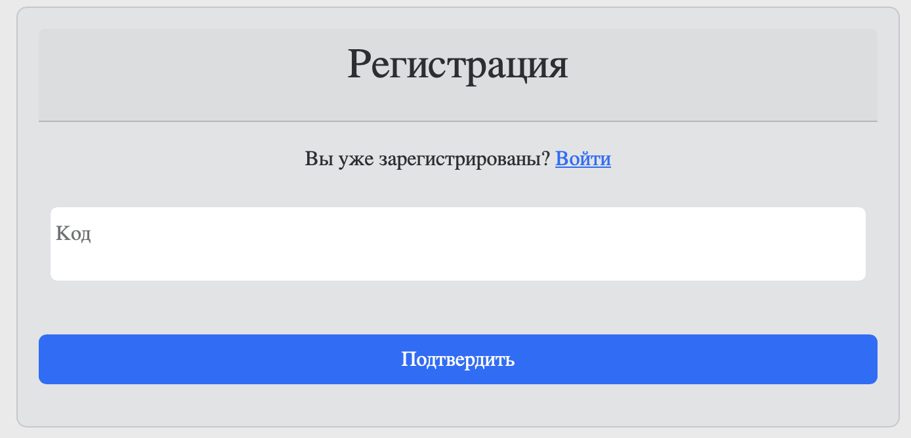
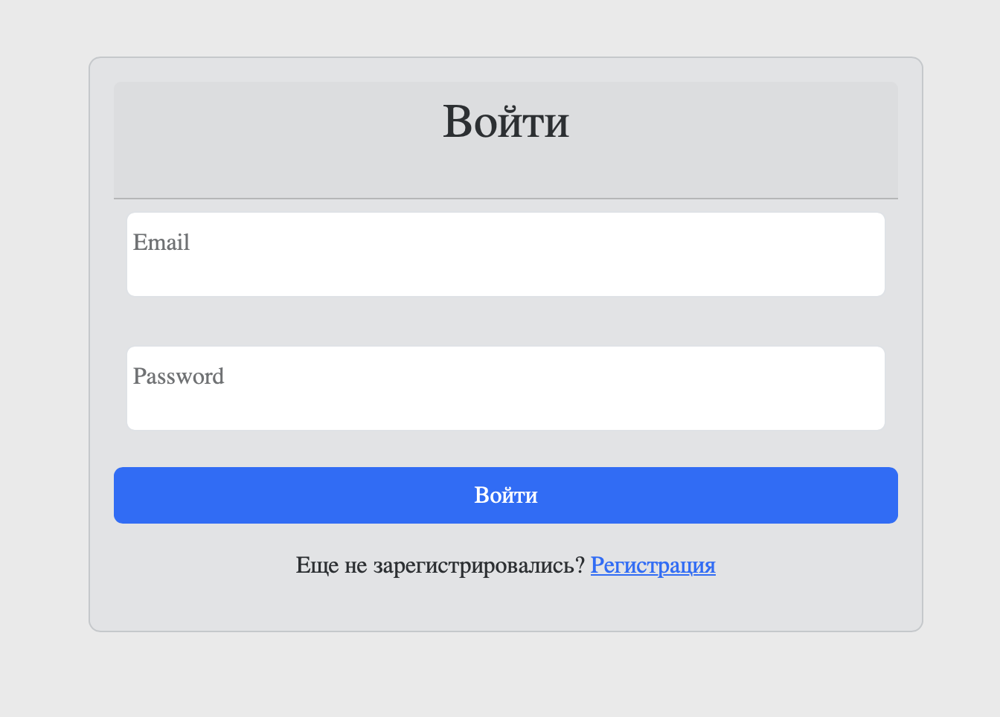

### Корзина
Добавлять товары в корзину может любой пользователь, но чтоб оформить заказ, необходимо зарегистрироваться.\
В приложении предусмотрено слияние корзин, поэтому пользователь не потеряет свои товары из корзины
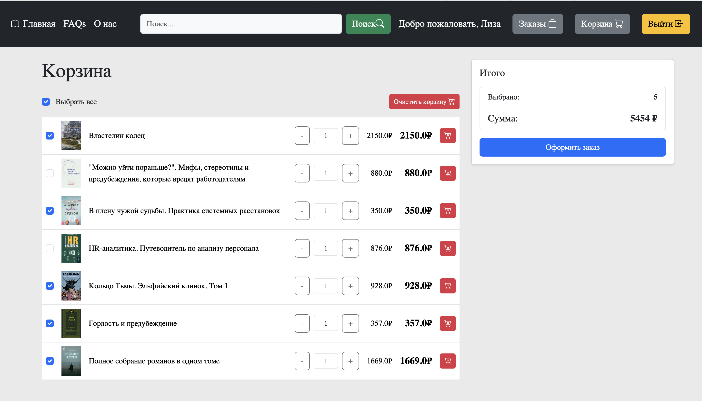
Так же пользователь может выбрать конкретные книги, которые он хочет оформить в данный момент в заказе, не потеряв при этом остальную корзину.

### Оформление заказа
Заказ может оформить только зарегистрированный пользователь
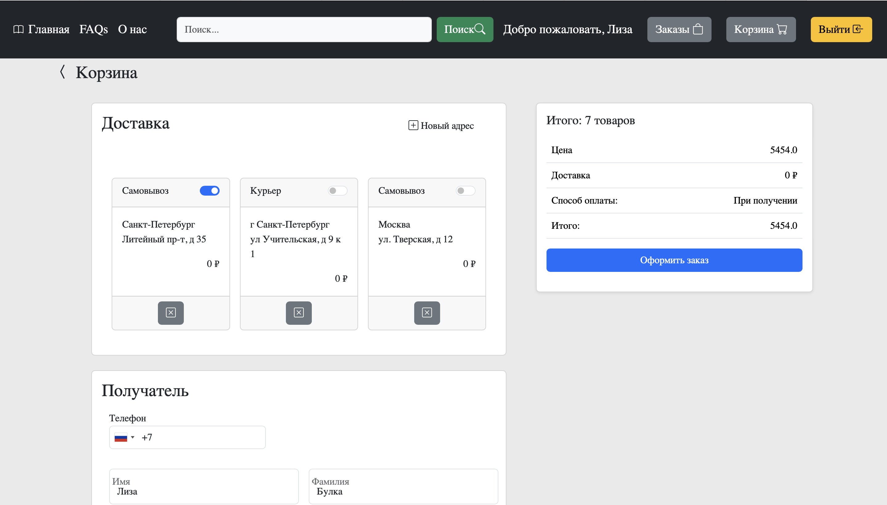
При заказе необходимо будет заполнить данные:
- Адрес, куда будет доставка (у пользователя есть возможность сохранять свои адреса и выбирать в последующих заказах)
- Личные данные (телефон, имя, фамилия получателя)
- Способ оплаты (Картой Онлайн, СБП, При получении). Оплата онлайн не реализована, но такой тип оплаты выбрать можно и заказ будет оформлен
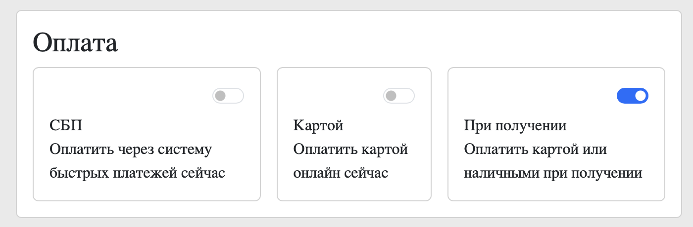

#### Адрес
В проекте реализованы 2 способа доставки:
- Самовывоз из магазинов(В 3 городах Москва, Казань, Санкт-Петербург)
- Курьером до дома

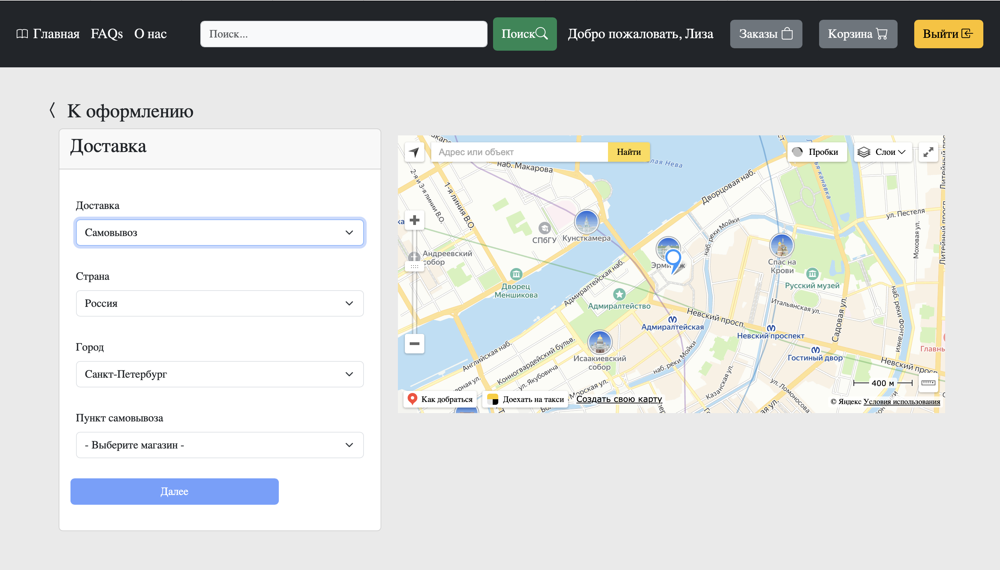
Карта реализована через API яндекс карт, а подсказки с помощью API сервиса Dadata. \
При выборе магазина из выпадающего списка или адреса курьерской доставки из подсказок, карта подсвечивает выбранный адрес.
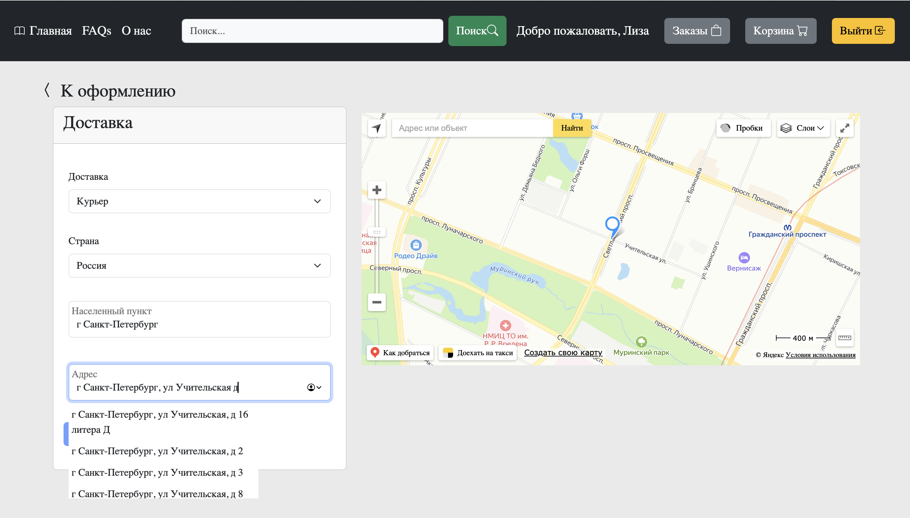

### Заказы
После оформления заказа, откроется страница с списком заказов
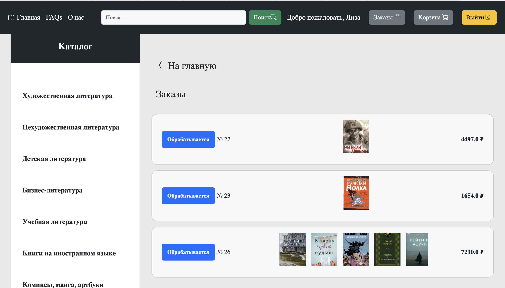
Их можно открыть и посмотреть подробную информацию о заказе
#### Подробная информация о заказе
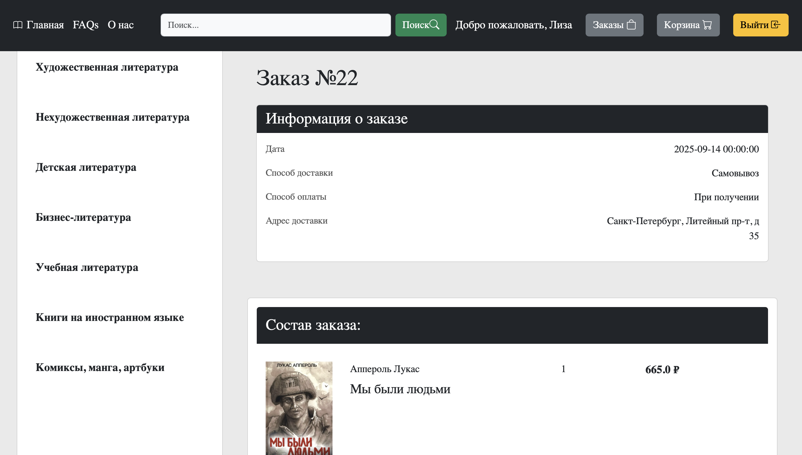

### Схема базы данных
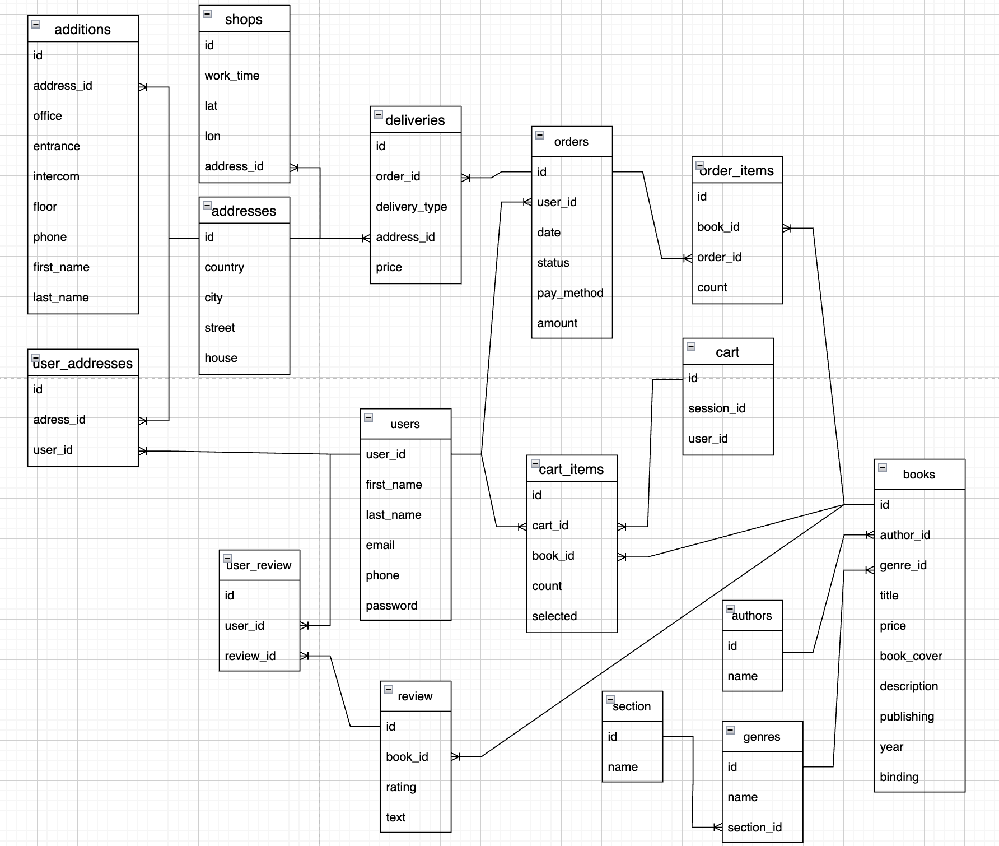
